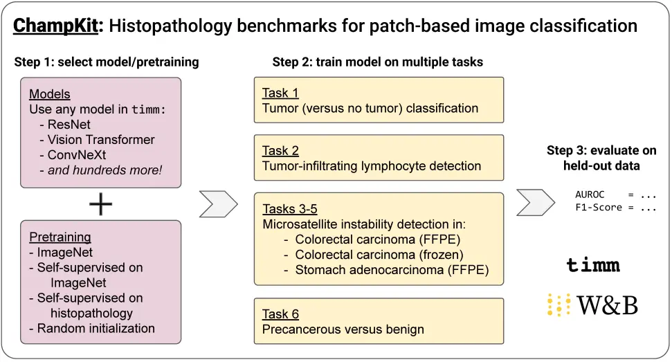

# ChampKit

[](assets/figure-overview.webp?raw=true)
<sub>_ChampKit_: Comprehensive Histopathology Assessment of Model Predictions toolKit.</sub>

A benchmarking toolkit for patch-based image classification in histopathology.

This toolkit is meant to be fully reproducible. Please start by installing the software environment.
Then download the datasets.

If you face any problems, please [submit a new issue](https://github.com/kaczmarj/champkit/issues/new/choose)!

- [Reproducing our manuscript](#reproducing-our-manuscript)
- [Installation](#installation)
  * [Software environment](#software-environment)
  * [Download and setup datasets](#download-and-setup-datasets)
- [Running multiple experiments](#running-multiple-experiments)
- [Extending ChampKit](#extending-champkit)
  * [Using other datasets](#using-other-datasets)
  * [Using other models](#using-other-models)
- [Citations](#citations)
- [Frequently asked questions](#frequently-asked-questions)
- [Uninstalling ChampKit](#uninstalling-champkit)

# Reproducing our manuscript

To reproduce our submission to the NeurIPS 2022 Datasets & Benchmarks Track (**TODO**: include link to arxiv), please follow the steps below. Ideally, we would include a script that reproduces the paper from start to finish, but unfortunately there are some steps that must be done manually.

1. Get the ChampKit code.
    ```bash
    git clone https://github.com/kaczmarj/champkit
    cd champkit
    git checkout v0.1.0
    ```
2. Install software dependencies. See [Software environment](#software-environment) for details.
    ```
    conda env create -f environment.yml -n champkit
    ```
3. Install datasets. Almost all of the datasets can be downloaded automatically. The Task 6 dataset (MHIST) needs to be downloaded manually. Please go to https://bmirds.github.io/MHIST/#accessing-dataset and complete the registration form. You will receive an automated email with download links. Please download the files `images.zip` and `annotations.csv` and move them to `data/task6_precancer_vs_benign_polyps/`. After you have done this, run the following script to take care of the rest. This script will download approximately 75 GB of data.
    ```bash
    bash setup.sh
    ```
    See [Download and setup datasets](#download-and-setup-datasets) for details.
4. Run experiments. We use Weights & Biases (W&B) sweeps to run and log the experiments. See [`sweeps/sweep_neurips_db.yml`](sweeps/sweep_neurips_db.yml) for the configuration. Please create an account on https://wandb.ai/ if you do not have one, and login on your machine with `python -m wandb login` (activate the champkit conda environment first).
    - Initialize the W&B sweep:
        ```bash
        python -m wandb sweep sweeps/sweep_neurips_db.yml
        ```
    - The command above will output a string like `USER/PROJECT/SWEEPID`. Use this in the next command.
    - Start an agent:
        ```bash
        CUDA_VISIBLE_DEVICES=0 python -m wandb agent USER/PROJECT/SWEEPID
        ```
        There are 42 training runs in this sweep. One can start multiple agents to go through the experiments faster. Each agent will poll W&B for the next experiment to run. If you have more agents running, the experiments will be done sooner. Please see [Running multiple experiments](#running-multiple-experiments) for more information.
    - The sweep requires at least 12 GB of GPU memory per agent. For the manuscript, we used Quadro RTX 8000 GPUs with 48 GB of video memory each.
5. Evaluate trained models. The following command will evaluate the best model for each run in the sweep (best = lowest validation loss). Results will be printed as they are calculated, and all results are saved to a CSV. The values in this CSV should be very similar to the values reported in the manuscript.
    ```
    CUDA_VISIBLE_DEVICES=0 python run_all_evaluations.py
    ```

# Installation

ChampKit requires software and datasets. The next two subsections explain how to install these.
If you experience any difficulty, please [submit a new issue](https://github.com/kaczmarj/champkit/issues/new/choose).

## Software environment

We use conda to manage Python environments. If you don't have conda, we recommend installing it with [Miniforge](https://github.com/conda-forge/miniforge).
Then, create the conda environment:

```
conda env create -f environment.yml -n champkit
conda activate champkit
```

We have tested the software on several x86-64 Linux systems, including Debian bookworm/sid, Red Hat 8.5, and Ubuntu 20.04
We have not tested this on Windows, macOS, or non-x86-64 architectures. While we did not test the Windows Subsystem for Linux (WSL), we anticipate that ChampKit will work in that environment (and we encourage you to try!).
ChampKit is tested with CUDA version 11.3, which requires NVIDIA driver `>=450.80.02`.

## Download and setup datasets

ChampKit includes scripts that download and process all included datasets, except MHIST.
To access the MHIST dataset, please complete the form at https://bmirds.github.io/MHIST/.
You will receive an email with links to the dataset (check spam folder if you don't see it).
Please download `images.zip` and `annotations.csv` and place them in `data/task6_precancer_vs_benign_polyps/`.

After the MHIST dataset is downloaded, please run the following code to download and setup all of the datasets.

This can take _a long time_ (2+ hours). One can run the `setup.sh` scripts in parallel, and that might speed things up.

```bash
conda activate champkit
bash data/task1_tumor_notumor/setup.sh
bash data/task2_tils/setup.sh
bash data/task3_msi_crc_ffpe/setup.sh
bash data/task4_msi_crc_frozen/setup.sh
bash data/task5_msi_stad_ffpe/setup.sh
bash data/task6_precancer_vs_benign_polyps/setup.sh
```

These are the different tasks and datasets.
Please cite the papers for the datasets you use ([Citations](#citations)).

- Task 1: Tumor versus non-tumor (https://zenodo.org/record/2546921)
- Task 2: Tumor-infiltrating lymphocyte detection (https://zenodo.org/record/6604094)
- Task 3: Microsatellite instability detection in colorectal carcinoma (FFPE) (https://zenodo.org/record/2530835)
- Task 4: Microsatellite instability detection in colorectal carcinoma (frozen) (https://zenodo.org/record/2532612)
- Task 5: Microsatellite instability detection in stomach adenocarcinoma (FFPE) (https://zenodo.org/record/2530835)
- Task 6: Precancerous versus benign colorectal polyps (https://bmirds.github.io/MHIST/)


# Running multiple experiments

[Weights & Biases](https://wandb.ai/) (W&B) tracks experiments and facilitates running
hyperparameter searches via sweeps. We use sweeps to train multiple models on multiple
datasets, with and without pretraining. W&B requires a (free) account (https://wandb.ai/).
Please make an account, and then login on the machine where you will be running the sweep.

```
conda activate champkit
python -m wandb login
```

After logging in, initialize the sweep with

```bash
python -m wandb sweep sweeps/sweep_neurips_db.yml
```

This will print `USER/PROJECT/SWEEPID`, which you will use in the next command.
Now that we ran `python -m wandb sweep`, wandb is waiting us to run "agents" that will run through
all of the combinations in the sweep configuration. When an agent is ready to run a new
job, it will ask W&B which combination to run next. You can run multiple agents at once.

The following command will run one agent for this sweep using one GPU (with ID=0).

```
CUDA_VISIBLE_DEVICES=0 python -m wandb agent USER/PROJECT/SWEEPID
```

In practice, I ([@kaczmarj](https://github.com/kaczmarj/)) like to run multiple agents on multiple GPUs in `screen` sessions.
The `screen` command runs a program in the background and will keep running it if you log out.

```bash
for device in 0 1 2; do
    CUDA_VISIBLE_DEVICES=$device screen -dmS champkit-$device python -m wandb agent USER/PROJECT/SWEEPID
done
```

# Extending ChampKit

## Using other datasets

ChampKit allows for integration with custom datasets that are framed as a single-task patch-level (binary or multi-class) classification.
Custom datasets must be organized in an ImageNet-like directory structure, in which the top-level directory contains directories `train`, `val`, and `test`, and each of those contains sub-directories of the
different classes (e.g., `tumor-positive`, `tumor-negative`), where the corresponding patch-level images are located.
Images can be of any size and will be resized during training and evaluation – the size is configurable. Put the dataset in the `data/` directory, and consider adding a `classmap.txt` file to indicate the order of the labels. In the example below, class 0 is tumor-negative, and class 1 is tumor-positive.

```
tumor-negative
tumor-positive
```

We would love to incorporate your dataset into ChampKit! Please [submit an issue](https://github.com/kaczmarj/champkit/issues/new) or email jakub.kaczmarzyk@stonybrookmedicine.edu if interested.

## Using other models

We use the excellent [`timm`](https://rwightman.github.io/pytorch-image-models/) package to have access to many models. Newly published models tend to be added to `timm` quickly, but there might be cases where you want to use a model that `timm` does not have. In those cases, please add a PyTorch implementation of your model to [`models.py`](models.py). See that file for examples of custom models or custom pretrained weights. Be sure to register your model with `timm` with the decorator `@timm.models.register_model`. This makes it possible to use the model with `timm.create_model(MODEL_NAME)`.

# Citations

Please cite the corresponding papers for any datasets you use.

<details><summary>Task 1 (tumor versus non-tumor classification)</summary>

```bibtex
@inproceedings{veeling2018rotation,
    title={Rotation equivariant CNNs for digital pathology},
    author={Veeling, Bastiaan S and Linmans, Jasper and Winkens, Jim and Cohen, Taco and Welling, Max},
    booktitle={International Conference on Medical Image Computing and Computer-Assisted Intervention},
    pages={210--218},
    year={2018},
    organization={Springer},
    url={https://doi.org/10.1007/978-3-030-00934-2_24}
}
```

```bibtex
@article{bejnordi2017diagnostic,
    title={Diagnostic assessment of deep learning algorithms for detection of lymph node metastases in women with breast cancer},
    author={Bejnordi, Babak Ehteshami and Veta, Mitko and Van Diest, Paul Johannes and Van Ginneken, Bram and Karssemeijer, Nico and Litjens, Geert and Van Der Laak, Jeroen AWM and Hermsen, Meyke and Manson, Quirine F and Balkenhol, Maschenka and others},
    journal={JAMA},
    volume={318},
    number={22},
    pages={2199--2210},
    year={2017},
    publisher={American Medical Association}
}
```
</details>


<details><summary>Task 2 (tumor-infiltrating lymphocyte detection)</summary>

```bibtex
@article{abousamra2022deep,
    author={Abousamra, Shahira and Gupta, Rajarsi and Hou, Le and Batiste, Rebecca and Zhao, Tianhao and Shankar, Anand and Rao, Arvind and Chen, Chao and Samaras, Dimitris and Kurc, Tahsin and Saltz, Joel},
    title={Deep Learning-Based Mapping of Tumor Infiltrating Lymphocytes in Whole Slide Images of 23 Types of Cancer},
    journal={Frontiers in Oncology},
    volume={11},
    year={2022},
    doi={10.3389/fonc.2021.806603},
    issn={2234-943X},
    url={https://doi.org/10.3389/fonc.2021.806603}
}
```

```bibtex
@article{saltz2018spatial,
    title={Spatial organization and molecular correlation of tumor-infiltrating lymphocytes using deep learning on pathology images},
    author={Saltz, Joel and Gupta, Rajarsi and Hou, Le and Kurc, Tahsin and Singh, Pankaj and Nguyen, Vu and Samaras, Dimitris and Shroyer, Kenneth R and Zhao, Tianhao and Batiste, Rebecca and Van Arnam, John},
    journal={Cell Reports},
    volume={23},
    number={1},
    pages={181--193},
    year={2018},
    publisher={Elsevier},
    url={https://doi.org/10.1016/j.celrep.2018.03.086},
    doi={10.1016/j.celrep.2018.03.086}
}
```

</details>


<details><summary>Tasks 3-5 (microsatellite instability detection)</summary>

```bibtex
@article{kather2019deep,
    title={Deep learning can predict microsatellite instability directly from histology in gastrointestinal cancer},
    author={Kather, Jakob Nikolas and Pearson, Alexander T and Halama, Niels and J{\"a}ger, Dirk and Krause, Jeremias and Loosen, Sven H and Marx, Alexander and Boor, Peter and Tacke, Frank and Neumann, Ulf Peter and others},
    journal="Nature Medicine",
    year="2019",
    month="Jul",
    day="01",
    volume="25",
    number="7",
    pages="1054--1056",
    issn="1546-170X",
    doi="10.1038/s41591-019-0462-y",
    url="https://doi.org/10.1038/s41591-019-0462-y"
}
```
</details>


<details><summary>Task 6 (precancerous versus benign colorectal polyp classification)</summary>

```bibtex
@inproceedings{wei2021petri,
    title={A Petri Dish for Histopathology Image Analysis},
    author={Wei, Jerry and Suriawinata, Arief and Ren, Bing and Liu, Xiaoying and Lisovsky, Mikhail and Vaickus, Louis and Brown, Charles and Baker, Michael and Tomita, Naofumi and Torresani, Lorenzo and Wei, Jason and Hassanpour, Saeed},
    booktitle={International Conference on Artificial Intelligence in Medicine},
    pages={11--24},
    year={2021},
    organization={Springer},
    url={https://doi.org/10.1007/978-3-030-77211-6_2},
    doi={10.1007/978-3-030-77211-6_2}
}
```
</details>

# Frequently asked questions

1. How do I get help?
    - If you have read through this document and still have questions, we encourage you to [create a new issue](https://github.com/kaczmarj/champkit/issues/new/choose). You could also email jakub.kaczmarzyk@stonybrookmedicine.edu, but we would prefer to have these discussions be public. If you have a question, others likely have similar questions!
2. How do I make a change to ChampKit?
    - Please use GitHub pull requests to propose changes.
3. I want to add a dataset to ChampKit.
    - We are always on the hunt for more patch-based histopathology image classification datasets. If you use a new dataset, please let us know. If it is publicly available, we would love to incorporate it into ChampKit.
4. How do I use a new dataset?
    - You can use ChampKit with any single-task, binary/multiclass image classification dataset. The dataset directories should be organized in ImageNet style. Please see [Using other datasets](#using-other-datasets) for more information.
5. How do I train and evaluate models?
    - Use `train.py` to train models. See `python train.py --help` for all options.
    - Use `validate.py` to evaluate models. See `python validate.py --help` for all options.
    - While this is not strictly required, we use Weights & Biases to run multiple experiments. Please see the sweeps in the `sweeps/` directory for examples of configurations.
6. I want to evaluate multiple training runs of the same model, but the result is always the same. Help!?
    - The `train.py` was written (originally by Ross Wightman) to reproduce training results when using the same seed. If you want to train multiple runs of a model, use different `--seed` values in `train.py`. The default is `--seed=42`.
7. How do I benchmark transfer learning from my favorite self-supervised histology model?
    - ChampKit includes a self-supervised model from [Ciga et al. (2022)](https://github.com/ozanciga/self-supervised-histopathology). If you want to use a different model, it will have to be added to ChampKit. In general, code will have to be added to `models.py` that downloads the weights and loads them into a PyTorch network. The architecture will have to be implemented if it does not exist in `timm`. Pull requests are welcome! We are happy to work with you to add models to ChampKit.
8. Why do you want me to use `python -m wandb` instead of `wandb`?
    - Using `python -m wandb` ensures that you use the wandb command installed in the champkit python environment (assuming the champkit conda environment is activated). If you use `wandb` directly, it is possible that this points to a different python environment than champkit. For example, if one had previously installed wandb with `pip install --user wandb`, the wandb executable would be in `~/.local/bin/wandb` and might be used instead of the wandb in the champkit environment.
    - In general, using `python -m PROGRAM` is better practice than using `PROGRAM` directly, because `python -m PROGRAM` guarantees we use `PROGRAM` installed in the current python environment. Using `PROGRAM` on its own relies on the `$PATH` variable, and it is possible that there exist multiple `PROGRAM` installations, one of which could appear in `$PATH` before the one we _think_ we are using.

# Uninstalling ChampKit

We hope you enjoyed using ChampKit. To uninstall ChampKit and all datasets, remove this directory and the `champkit` conda environment.

```
conda deactivate
conda env remove --name champkit
```
